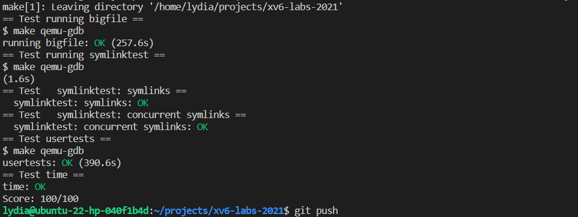

# File system

## Large files (moderate)

To handle large files in an operating system with an ext2-like filesystem, it is necessary to analyze the code example provided for handling inode layout, which stores pointers to the data blocks.
<!-- To handle the large files in an operating system with ext2-like filesystem, it is straightforward to start analyzing the code example given for handling inode layout, where store the pointers to the datablocks. -->

The given filesystem inode in this case should have the following layout: (the layout was generated using `copilot`, so there is no script available for creating it)
<!-- In this case the given filesystem inode should look like the following: (the layout is generated with the help of copilot, so there is no script for creating it) -->

```txt
0-10: direct
11: singly indirect
12: doubly indirect

| index | addrs[i] |    singly indirect      |            doubly indirect              |
|-------|----------|-------------------------|-----------------------------------------|
|   0   |        --|--> [ data block  0 ]
|   1   |        --|--> [ data block  1 ]
|   2   |        --|--> [ data block  2 ]
|   3   |        --|--> [ data block  3 ]
|  ...  |        --|--> [ data block ...]
|   9   |        --|--> [ data block  9 ]
|  10   |        --|--> [ data block 10 ]
|  11   |        --|-->   index block 0
                        [   entry  0    ] --> [data block  11 ]
                        [   entry  1    ] --> [data block  12 ]
                        [   entry  2    ] --> [data block  13 ]
                        [   entry ...   ] --> [data block ... ]
                        [   entry 255   ] --> [data block 266 ]
|  12   |        --|-->   index block 1
                        [ entry  0   ] -->   index block 2
                                            [   entry  0    ] --> [ data block  267  ]
                                            [   entry  1    ] --> [ data block  268  ]
                                            [   entry  2    ] --> [ data block  269  ]
                                            [   entry ...   ] --> [ data block  ...  ]
                                            [   entry 255   ] --> [ data block  522  ]
                        [ entry  1   ] -->   index block 3
                                            [   entry  0    ] --> [ data block  523  ]
                                            [   entry  1    ] --> [ data block  524  ]
                                            [   entry  2    ] --> [ data block  525  ]
                                            [   entry ...   ] --> [ data block  ...  ]
                                            [   entry 255   ] --> [ data block  776  ]
                        [ entry ...  ] -->   index block ...
                                            [   entry  0    ] --> [ data block  ...  ]
                                            [   entry  1    ] --> [ data block  ...  ]
                                            [   entry  2    ] --> [ data block  ...  ]
                                            [   entry ...   ] --> [ data block  ...  ]
                                            [   entry 255   ] --> [ data block  ...  ]
                        [ entry 255  ] -->   index block 255
                                            [   entry  0    ] --> [ data block 65547 ]
                                            [   entry  1    ] --> [ data block 65548 ]
                                            [   entry  2    ] --> [ data block 65549 ]
                                            [   entry ...   ] --> [ data block  ...  ]
                                            [   entry 255   ] --> [ data block 65802 ]
```

To implement the doubly-indirect block, we can follow the structure of the singly-indirect block and modify the `bmap` function as follows:

1. First, check if the given block number (`bn`) is within the range of the direct blocks (`0` to `NDIRECT-1`). If it is, return the block number as is.
2. If the block number is within the range of the singly-indirect blocks (`NDIRECT` to `NDIRECT + NINDIRECT - 1`), compute the group index and in-group index as described above. Then, use these indices to access the corresponding block in the singly-indirect block.
3. If the block number is within the range of the doubly-indirect blocks (`NDIRECT + NINDIRECT` to `NDIRECT + NINDIRECT + NINDIRECT^2 - 1`), repeat the process used in step 2, but this time accessing the block in the doubly-indirect block.

For example, to locate the datablock with number 511 in the doubly-indirect block, we would first compute the group index as `511 / NINDIRECT = 1` and the in-group index as `511 % NINDIRECT = 255`. This would tell us that we need to access the 255th block in the second group of the doubly-indirect block.

So we can have the following code:
<!-- So we can just follow the structure to manage our filesystem. According to the instructions given, we should modify the `bmap` function to enable the use of a doubly-indirect block, and we shall start from here.

Additionally, we wrote a script to enumerate the acceptable choices for these 3 types of index (direct, singly-indirect and doubly-indirect), although it was not necessary here, the instructions have already explicitly specified the task we should accomplish.

According to the layout we have above, we can see that the index blocks should contain the same number of data block entries. For the first level of index blocks (index block 0 and index block 1 above), they should contain 256 entries each, and for the second level of index blocks should also contain the same number of entries.

So, for the singly-indirect block with index 11, it should contain 256 datablocks; for the doubly-indirect block with index 12, it should contain 256 * 256 = 65536 datablocks in total. But for convenience, we can compute the index by group, each group of the datablocks in doubly-indirect block will be identified by the index block entry number, so when we need to locate specific datablocks in the doubly-indirect block, it is easy to compute the group index and the in-group index with `bn / NINDIRECT` and `bn % NINDIRECT`, respectively. Here, `bn` represents the datablock number, `NINDIRECT` represents the number of first level indirect blocks.

Therefore, we can follow the implementation for singly-indirect blocks to accomplish our doubly-indirect blocks like this: -->
```c
// in file fs.c, function bmap
...
  // the part handling the direct and singly-indirect blocks
  ...

  bn -= NINDIRECT;
  if (bn < NDINDIRECT) {
    // Load doubly-indirect block, allocating if necessary.
    if ((addr = ip->addrs[NDIRECT + 1]) == 0)
      ip->addrs[NDIRECT + 1] = addr = balloc(ip->dev);
    bp = bread(ip->dev, addr);
    a = (uint*)bp->data;
    if ((addr = a[bn / NINDIRECT]) == 0) {
      a[bn / NINDIRECT] = addr = balloc(ip->dev);
      log_write(bp);
    }
    brelse(bp);
    bp = bread(ip->dev, addr);
    a = (uint*)bp->data;
    if ((addr = a[bn % NINDIRECT]) == 0) {
      a[bn % NINDIRECT] = addr = balloc(ip->dev);
      log_write(bp);
    }
    brelse(bp);
    return addr;
  }
```

To modify the code that handles discarding the inode in the `itrunc` function, we can follow a similar structure as the original code handling the singly-indirect blocks. Here is the code that should be added:

1. First, we need to handle the doubly-indirect block by looping through the first level index entries. We can do this by adding a `for` loop that iterates from the base index of the `addr` array (which is the index of the doubly-indirect block, DNIRECT + 1) to the end of the array.
2. Inside the loop, we need to check if the current index entry is non-zero. If it is, we should free the block pointed to by the entry and set the entry to zero.
3. After the loop, we can proceed with the rest of the `itrunc` function as normal, handling the singly-indirect and direct blocks in the same way as before.
<!-- Additionally, we need to modify code that discarding the indoe in function `itrunc`. We can insert our code handling the doubly-indirect blocks in a similar with as the original code handling the singly-indirect blocks. The only differences here is the base index for `addr` array should be the index of the doubly-indirect index `DNIRECT + 1`, and there should be a loop to iterate through the first level index entries.

Here is the code we should add: -->
```c 
// in file fs.c, function itrunc
  ...
  // trucate inode, handle the case for direct and singly-indirect index blocks
  ...
  // handle the case for doubly-indirect blocks
  if(ip->addrs[NDIRECT + 1]) {
    bp = bread(ip->dev, ip->addrs[NDIRECT + 1]);
    a = (uint*)bp->data;
    for (i = 0; i < NINDIRECT; i++) {
      if (a[i]) {
        struct buf *bp2 = bread(ip->dev, a[i]);
        uint *a2 = (uint*)bp2->data;
        for (j = 0; j < NINDIRECT; j++) {
          if (a2[j])
            bfree(ip->dev, a2[j]);
        }
        brelse(bp2);
        bfree(ip->dev, a[i]);
      }
    }
    brelse(bp);
  }
  ...
```

After making these modifications, the `bigfile` test should pass. It is expected that running this test will take some time, as it involves creating a large file that utilizes the doubly-indirect block. On our machine, the default time limit for running the test is not enough, so we update the `Makefile` by setting the `timeout` in `test_bigfile` from `180` to `300`.
<!-- We should pass the `bigfile` test now, notice that it really takes time to run the test, and the time limit for our machine is not enough, so when run `make grade` for this lab, we have to update the time limit in the `Makefile`. -->

## Symbolic links (moderate)

<!-- The goal of this task is to create a symbolic link that connect the 'filepath' with a new symbolic link file.

Generally, there are three parts to complete the task:

1. Update files related to the syscall. This will be finished by following the guide from course website instructions.
2. Write the syscall function to be invoked, `sys_symlink`. We can place this function in the `sysfile.c`, in which there are many definitions of filesystem related syscalls.
3. Update the `sys_open` to handle the symbolic link syscall. We should add a `if` statement branch to handle the new file type `T_SYMLINK`. Here, one more notice to handle is the `O_NOFOLLOW` open mode bit, as it is easy to misunderstand its usage. However, it is just the iteral meaning of `O_NOFOLLOW`: not follow the link to visit target file but just return the link file itself.

Now, let's start with the most basic part: update the related files of the syscall `sys_symlink`.

The open modes (`omode`) are defined in `fcntl.h`, and the open mode interpretation is a bit-wise operation, so we should select a not used bit to be the bit for the `O_NOFOLLOW` operation. Here, we add a bit representation of other definations and add a definition of `O_NOFOLLOW` to the file.
 -->
The goal of this task is to create a symbolic link that connects the 'filepath' with a new symbolic link file.

To complete this task, the following steps must be taken:

1. Update the files related to the `sys_symlink` syscall. This can be done by following the instructions on the course website.
2. Write the `sys_symlink` syscall function, which should be placed in sysfile.c along with the other filesystem-related syscalls.
3. Update `sys_open` to handle the `sys_symlink` syscall by adding an if statement branch to handle the new file type `T_SYMLINK`. One thing to note is the `O_NOFOLLOW` open mode bit, as it is easy to misunderstand its usage. It simply means not to follow the link to the target file, but to return the link file itself.

Let's start with the first step: updating the files related to the `sys_symlink` syscall.

The open modes (`omode`) are defined in `fcntl.h`, and their interpretation is done through bitwise operations. Therefore, we should select an unused bit to represent the `O_NOFOLLOW` operation. In addition to the existing definitions, we should add a definition for `O_NOFOLLOW` to the file.

```c
// fcntl.h
#define O_RDONLY   0x000 // 0b0000'0000'0000'0000
#define O_WRONLY   0x001 // 0b0000'0000'0000'0001
#define O_RDWR     0x002 // 0b0000'0000'0000'0010
#define O_NOFOLLOW 0x004 // 0b0000'0000'0000'0100
#define O_CREATE   0x200 // 0b0000'0000'0010'0000
#define O_TRUNC    0x400 // 0b0000'0000'0100'0000
```

Also, add a new file type to `stat.h`:

```c
// stat.h
...
#define T_SYMLINK 4   // Symbolic link
...
```

<!-- Other parts related to adding a syscall, including add an entry in the perl script `usys.pl`, create a new syscall index `SYS_symlink` for function `sys_symlink` in `syscall.h`, add global declaration in `syscall.c` and bind the function with the index just after the global declaration. Here are the updated files: -->
Other parts related to adding a syscall, including adding an entry in the perl script `usys.pl`, creating a new syscall index `SYS_symlink` for the `sys_symlink` function in `syscall.h`, adding a global declaration in `syscall.c`, and binding the function with the index just after the global declaration. Here are the updated files:

```c
// usys.pl
...
entry("symlink");
```

```c 
// syscall.h
...
#define SYS_symlink 22
```

```c 
// syscall.c
...

extern uint64 sys_symlink(void);

static uint64 (*syscalls[])(void) = {
...
[SYS_symlink] sys_symlink,
};

...
```
<!-- 
Now, we can start implementing the core part of the system call. We place the syscall function `sys_symlink` in file `sysfile.c`, which is a source file for placing filesystem related syscalls, including `create` and `sys_open`.

In the `sys_symlink` function, we should first fetch the arguments from trapframe by using `argstr`. The syscall prototype given by course website is `symlink(char *target, char *path)`, so the arguments in position `0` is the source file to be referred, and the argument in the position `1` is the path of the symbolic link to be created, namely the new file path. Then we should create a new inode with file type `T_SYMLINK` to store the data (the original path for the file), so we write data in the inode using function `writei`. After operating the inode, the `iunlockput` should be called to release lock on the inode. -->
Now, we can start implementing the core part of the system call. We will place the `sys_symlink` function in the `sysfile.c` file, which is a source file for filesystem-related syscalls, including `create` and `sys_open`.

In the `sys_symlink` function, we first need to fetch the arguments from the trapframe using `argstr`. The syscall prototype given by the course website is `symlink(char *target, char *path)`, so the argument at position `0` is the source file to be referred to, and the argument at position `1` is the path of the symbolic link to be created, namely the new file path. Then we need to create a new inode with file type `T_SYMLINK` to store the data (the original path for the file). We do this by writing data to the inode using the `writei` function. After operating on the inode, we should call `iunlockput` to release the lock on the inode.

```c 
uint64
sys_symlink(void)
{
  char name[MAXPATH], target[MAXPATH];
  struct inode *ip;

  begin_op();
  if(argstr(0, name, MAXPATH) < 0 || argstr(1, target, MAXPATH) < 0){
    end_op();
    return -1;
  }
  if ((ip = create(target, T_SYMLINK, 0, 0)) == 0){
    end_op();
    return -1;
  }
  // int writei(struct inode *ip, int user_src, uint64 src, uint off, uint n);
  // Currently, I am not sure user_src is 0 or 1. 0 means kernel, 1 means user.
  // off is the offset in the file, n is the number of bytes to write.
  // off = 0, n = strlen(target)
  if (writei(ip, 0, (uint64)name, 0, strlen(name)) != strlen(name)){
    end_op();
    return -1;
  }
  iunlockput(ip);
  end_op();

  return 0;
}
```

<!-- However, the variable names we used here may make some confusions, that the `name` string represents the `target` in system call prototype, while the `target` string represents the `path` in system call prototype. 

One more thing to be mentioned here is an argument for function `writei`. It is not very clear at first whether the `user_src` argument should be 0 (run in kernel), or 1 (run in user space), but we can guess that the syscall is working in kernal space so the writei should also work in kernel space. -->
However, the variable names we used here may cause some confusion, as the `name` string represents the `target` in the system call prototype, while the `target` string represents the `path` in the system call prototype. 

One more thing to mention is an argument for the `writei` function. It is not immediately clear whether the `user_src` argument should be 0 (run in kernel) or 1 (run in user space). However, we can assume that the syscall is running in kernel space, so `writei` should also run in kernel space.

Next, we need to handle the case of opening a symbolic link file, which involves modifying the code in the `sys_open` file. It is easy to add a branch to handle `T_SYMLINK` just below the branch that handles `T_DIR`:

```c 
// function sys_open
...
  if(omode & O_CREATE){
    ip = create(path, T_FILE, 0, 0);
    if(ip == 0){
      end_op();
      return -1;
    }
  } else {
    if((ip = namei(path)) == 0){
      end_op();
      return -1;
    }
    ilock(ip);
    if(ip->type == T_DIR && omode != O_RDONLY){
      iunlockput(ip);
      end_op();
      return -1;
    }
    // insert the code here
  }
  ...
```

Before implementing this, we should consider the hints given by the course website:

> "Modify the `open` system call to handle the case where the path refers to a symbolic link. If the file does not exist, `open` must fail. When a process specifies `O_NOFOLLOW` in the flags to open, open should open the symlink (and not follow the symbolic link).
> 
> If the linked file is also a symbolic link, you must recursively follow it until a non-link file is reached. If the links form a cycle, you must return an error code. You may approximate this by returning an error code if the depth of links reaches some threshold (e.g., 10)."

Therefore, we need to consider the following cases:

1. Recursively visiting the symbolic link until the depth limit is reached or a non-link file is found.
2. Handling the `O_NOFOLLOW` flag, which means not following the symbolic link but just opening the link file itself.
3. If the file does not exist, `open` must fail.

<!-- However, it is not very clear how to **recursively** visit the symbolic link, as it seems not very handy to rewrite the `sys_open` to be a recursion function, which include using the argument fetch funtion. And it may not be a good idea to write another function to solve this problem from our straightforward thoughts (which may not be correct, but just a kind of preference).

So, we handle this by using a loop, but when writing this part, it is straightforward to write a if statement to handle the case, record the count of visiting depth and then if satisfied, visit next symlink again. This can be done by a simple goto statement, and this seems also easy to be optimized as for loop. -->

It is not immediately clear how to handle the recursive visiting of the symbolic link. Rewriting the `sys_open` function as a recursive function using an argument fetch function may not be the most convenient solution. Writing a separate function to handle this may also not be the best approach.

Therefore, we decided to use a loop instead. To handle the case of recursive visiting, it is straightforward to write an if statement that checks the depth count and, if necessary, jumps back to the beginning of the loop using a `goto` statement. This can also be easily optimized into a for loop.

```c
// sys_open
...
    // insert the code here
    int link_count = 0;
    if (ip->type == T_SYMLINK && !(omode & O_NOFOLLOW)) {
      SIMLINK_TAG:
      link_count++;
      // char buf[MAXPATH];
      n = readi(ip, 0, (uint64)path, 0, MAXPATH);
      if (n < 0) {
        iunlockput(ip);
        end_op();
        return -1;
      }
      path[n] = '\0';
      iunlockput(ip);
      if((ip = namei(path)) == 0){
        end_op();
        return -1;
      }
      ilock(ip);
      if (ip->type == T_SYMLINK && !(omode & O_NOFOLLOW)) {
        if (link_count > 10) {
          iunlockput(ip);
          end_op();
          return -1;
        }
        goto SIMLINK_TAG;
      }
    }
...
```

Now, we should be able to pass all tests when running `make grade` in the `fs` branch.


## Make grade



