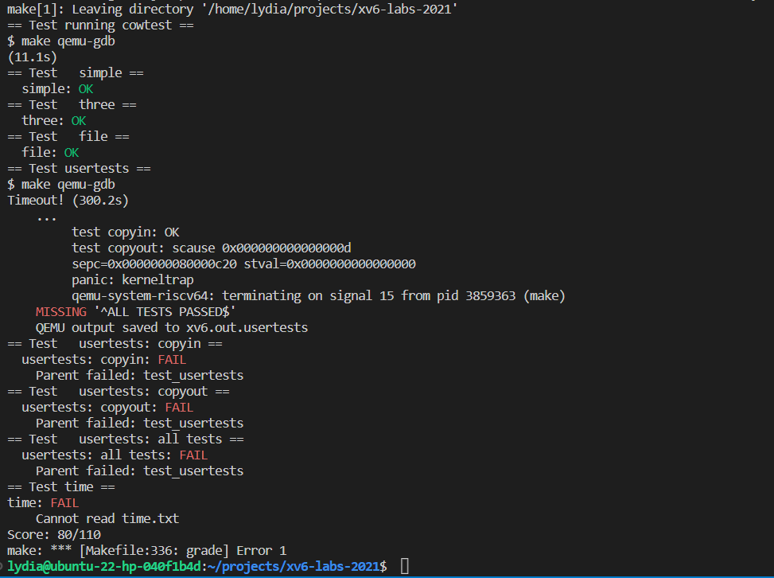

# Copy-on-Write Fork for xv6

## Implement copy-on write (hard)

The general idea is to mark all pagetables as not writable and with bits for recognizing copy-on-write (COW) set to 1. Whenever a page fault occurs, the trap handling function should be able to identify this cause and update the pagetable.

This allows the copy process of fork to happen only when the process needs to write corresponding memory, which would save a lot of time when forking a very large process.

To implement this functionality, the instructions on the [lab website](https://pdos.csail.mit.edu/6.828/2021/labs/cow.html) give a list of functions that should be modified:

- `uvmcopy`: remove the memory allocation and map the parent to the child
- `usertrap`: where we handle the page fault, the core part of this task
- `kallc` and `kfree`: manage the page's reference count
- `kinit`: initialize the page's reference count
- `copyout`: reuse the scheme in `usertrap` to handle COW pages

To start with, we will update the `uvmcopy` function. We need to remove the memory allocation part of the original code. An initial attempt at this is shown below:

```c
int
uvmcopy(pagetable_t old, pagetable_t new, uint64 sz)
{
  pte_t *pte;
  uint64 pa, i;
  uint flags;

  for(i = 0; i < sz; i += PGSIZE){
    // The reason we use walk here is to validate the PTE flags.
    // So that we can make sure the PTE is valid and needs to be copied.
    if((pte = walk(old, i, 0)) == 0)
      panic("uvmcopy: pte should exist");
    if((*pte & PTE_V) == 0)
      panic("uvmcopy: page not present");
  } // examine the old pagetable
  for (i = 0; i< 512; i++) {
    *pte = &old[i];        // get pointer to old page table entry
    *pte = *pte & ~PTE_W;  // clear write bit
    *pte = *pte | PTE_COW; // set COW bit
    new[i] = *pte;         // copy page table entry directly
    // increase the page reference count
    page_reference_count[PGREF_CNT(pa)]++;
  }
  return 0;
}
```

We can remove the rest of the original code that uses the `mappages` function or allocates memory. This is because we can update the PTE manually later in the given `for` loop.
<!-- The above code only retains the first part of original code. We can remove the rest part that use mappages or allocate memory, because we can update the PTE manualy later in the given `for` loop. -->

In the `copyout` function, we can insert a branch to check for `COW` pages marked by `PTE_COW`. The original code in this function uses `walkaddr` instead of `walk` to avoid potential vulnerabilities when writing to the `pte`. However, in this case we need to update the `pte` according to the `pte` flags, so we can replace the `walkaddr` function with the `walk` function and obtain a returned value of type `pte_t *`. We can then update the page reference count based on the count of the specific physical address. There is no need to use the `mappages` function here, as we can directly modify the value of a specific `pte` using its pointer.
<!-- Move on, in the `copyout` function, we can insert a branch to judge the `COW` pages marked by `PTE_COW`. The original code in this funciton use `walkaddr` rather than `walk` to avoid potential vulnerability in write the `pte`. However, here we just need to update the `pte` according to the page tags, so we can replace the `walkaddr` with `walk` function, and get a returned value `pte` of type `pte_t *`. And then, we can update the page reference count according to the count of specific physical address. We don't need to `mappages` here because we can directly modify the value of specific `pte` using its pointer. -->

The `page_reference_count` array should be declared using the `extern` keyword to make the global variable accessible in this file. It is defined in `kalloc.c`.
<!-- The `page_reference_count` array should be declared using `extern` to make the global variable reacheable in this file, which is defined in the `kalloc.c`. -->

```c
int
copyout(pagetable_t pagetable, uint64 dstva, char *src, uint64 len)
{
  uint64 n, va0, pa0;
  pte_t * pte;

  while(len > 0){
    va0 = PGROUNDDOWN(dstva);
    pte = walk(pagetable, va0, 0);
    pa0 = PTE2PA(*pte);
    if(pa0 == 0)
      return -1;
    n = PGSIZE - (dstva - va0);
    if(n > len)
      n = len;
    if (*pte & PTE_COW) {
      // if the page is COW, we need to copy the page first
      // before we can write to it
      uint flags = PTE_FLAGS(*pte);
      char *page;
      if((page = kalloc()) == 0)
        panic("copyout(): out of memory");
      memmove(page, (char*)pa0, PGSIZE);
      *pte = PA2PTE((uint64)page) | (flags & ~PTE_COW) | PTE_W;
      // decrease the page reference count
      if (page_reference_count[PGREF_CNT(pa0)] <= 1) {
        page_reference_count[PGREF_CNT(pa0)] = 0;
        pa0 = (uint64) page;
      } else {
        page_reference_count[PGREF_CNT(pa0)]--;
      }
    }
    // original code here
    memmove((void *)(pa0 + (dstva - va0)), src, n);
    ...
  }
  return 0;
}
```

In `kalloc.c`, there are several slight modifications that should be applied. First, define the `page_reference_count` array with a size of `(PHYSTOP-KERNBASE) / PGSIZE`, as suggested by the `cowtest.c` file shown below:
<!-- For `kalloc.c`, there is so many slight modifications should be applied. First, define the `page_reference_count` array with the size of `(PHYSTOP-KNERBASE) / PGSIZE`, which is a hint from `cowtest.c` shown below: -->

```c 
void
simpletest()
{
  uint64 phys_size = PHYSTOP - KERNBASE;
  // other part of code
  ...
}
```

This is slightly different from what is mentioned on the [lab website](https://pdos.csail.mit.edu/6.828/2021/labs/cow.html):

> "You'll have to work out a scheme for how to index the array and how to choose its size. For example, you could index the array with the page's physical address divided by 4096, and give the array a number of elements equal to highest physical address of any page placed on the free list by kinit() in kalloc.c."

However, the currently implemented approach theoretically saves more memory.

The next modification to be made in `kalloc.c` is applied to the `kalloc` function. We should set the reference count of each newly allocated memory block to 1.

```c 
void *
kalloc(void)
{
  struct run *r;
  // other part of code
  ...
  if(r){
    memset((char*)r, 5, PGSIZE); // fill with junk
    page_reference_count[PGREF_CNT((uint64)r)] = 1; // inserted here
  }

  return (void*)r;
}
```

Later on, we need to focus on the very important part of this task: handling the page fault in the `usertrap` function. We use the `r_scause()` function to retrieve the value from the RISC-V `SCAUSE` register, which is used to store the type of fault. We can refer to the RISC-V manual to find the appropriate `scause` value for a page fault, as shown [here](https://five-embeddev.com/riscv-isa-manual/latest/supervisor.html#sec:scause) or in the table below:

| Interrupt | Exception Code | Description            |
|-----------|----------------|------------------------|
| 0         | 12             | Instruction page fault |
| 0         | 13             | Load page fault        |
| 0         | 14             | Reserved               |
| 0         | 15             | Store/AMO page fault   |

From the descriptions, we can understand that the page fault `scause` value for `COW` handling should be `12`, `13`, or `15` (actually, it should only be `15` because `COW` pages should only be handled during write operations, which correspond to `store` page faults, but it won't influence the program's behavior in this lab).
<!-- Later on, we should focus on the very important part of this task, that is hanling the page fault in usertrap function. We use `r_scause()` to retrieve from RISC-V SCAUSE register, which is used for storing type of the fault, we can refer to the RISC-V manual to find the suitable scause value for a page fault, see [here](https://five-embeddev.com/riscv-isa-manual/latest/supervisor.html#sec:scause), or the types listed as follows:

| Interrupt | Exception Code | Description            |
|-----------|----------------|------------------------|
| 0         | 12             | Instruction page fault |
| 0         | 13             | Load page fault        |
| 0         | 14             | Reserved               |
| 0         | 15             | Store/AMO page fault   |

From the descriptions we can understand that the page fault for cow handling's scause value should be 12, 13 or 15 (actually should only be 15 because cow page should only be handled during the write behavior, which is corresponding to `store` page fault). -->

```c
if(r_scause() == 8){
    // handling syscall
    ...
    syscall();
  } else if(r_scause() == 12 || r_scause() == 13 || r_scause() == 15){
    // page fault
    uint64 va = r_stval(); // store the faulting address
    // free previous page and add the newly allocated page to the pagetable
    uint64 * pte = walk(p->pagetable, va, 0);
    if (pte == 0) {
      panic("usertrap(): pte should exist\n");
    }
    if ((*pte & PTE_V) == 0) {
      panic("usertrap(): page should exist\n");
    }
    if ((*pte & PTE_COW)) {
      uint64 pa = PTE2PA(*pte);
      uint flags = PTE_FLAGS(*pte);
      char* page;  // allocate a new page
      if ((page = kalloc()) == 0) {
        p->killed = 1;
        goto trap_err;
      }
      memmove(page, (char*)pa, PGSIZE); // copy the content of the old page to the new page
      *pte = PA2PTE((uint64)page) | (flags & ~PTE_COW) | PTE_W;

      // free the old page if the last reference to it is removed
      if (page_reference_count[PGREF_CNT(pa)] <= 1) {
        page_reference_count[PGREF_CNT(pa)] = 0;
        pa = (uint64)page;
      } else {
        page_reference_count[PGREF_CNT(pa)]--;
      }
    }
  } else if((which_dev = devintr()) != 0){
    // ok
  } else {
    printf("usertrap(): unexpected scause %p pid=%d\n", r_scause(), p->pid);
    printf("            sepc=%p stval=%p\n", r_sepc(), r_stval());
    p->killed = 1;
  }
trap_err:
  ...
  // the rest of the function
```

The idea applied here is similar to that used in the `copyout` function, as instructed. We still use the pointer to the `pte` so that we don't need to call the `mappages` function to `walk` through the `va` again.
<!-- The idea applied here is similar to that in copyout, just as the instructions hinted. We still use the pointer of `pte` so that we do not need to call function `mappages` to `walk` through the `va` again. -->

However, something went wrong in the `usertests` even though the `cowtest` passed. It resulted in a kernel trap when running the `usertests` copyout. I tried several approaches here, including moving the page reference count into the `kfree` function as many bloggers do, and handling the MAXVA problem in the page fault handling section.
<!-- However, something crashed in the usertests even when the cowtest pass, and it yield a kernel trap when running the usertests copyout. I tried several attempts here, including move the page reference count into the kfree function as many bloggers do, handle the MAXVA problem in page fault handling section and so on. -->

The updated code is explained below, although it still only passes the `cowtest` and gets stuck even at the first `usertests`, which makes things worse, but I forgot to commit my previous code here, only the commented code line remains.
<!-- The updated code are explained as follows, though can only pass cowtest, and even stuck at the first usertests. -->

First, I rewrote my `uvmcopy` function as many bloggers do - I just removed the allocation part but kept the `mappages` function here. This is because it is okay to use `mappages` here to ensure the correctness of the code before passing the `usertests`. That is, I made as few changes to the original code as possible for now.
<!-- First, I rewrite my uvmcopy function as many bloggers do - just remove the allocating part but remain the mappages function here, because it okay to use mappages here to guarantee the correctness of code before passing the usertests. That is, make as least changes to the original code as possible now. -->

```c
int
uvmcopy(pagetable_t old, pagetable_t new, uint64 sz)
{
  pte_t *pte;
  uint64 pa, i;
  uint flags;

  for(i = 0; i < sz; i += PGSIZE){
    // The reason we use walk here is to validate the PTE flags.
    // So that we can make sure the PTE is valid and needs to be copied.
    if((pte = walk(old, i, 0)) == 0)
      panic("uvmcopy: pte should exist");
    if((*pte & PTE_V) == 0)
      panic("uvmcopy: page not present");
    pa = PTE2PA(*pte);
    flags = (PTE_FLAGS(*pte) & (~PTE_W)) | PTE_COW;

    *pte = PA2PTE(pa) | flags;
    if(mappages(new, i, PGSIZE, pa, flags) != 0)
      goto err;
    if(((uint64)pa % PGSIZE) != 0 || (char*)pa < end || (uint64)pa >= PHYSTOP)
      goto err;
    page_reference_count[PGREF_CNT(pa)]++;
  }
  return 0;

 err:
  uvmunmap(new, 0, i / PGSIZE, 1);
  return -1;
}
```

Next, we updated the `copyout` function and moved the page reference count behavior into the `kfree` function. This allows us to handle the reference count in an implicit way. In the branch of the `if` statement that handles `COW` pages, we replaced the decrease page reference count part with a single `kfree` statement.
<!-- Next, update the copyout function, move the page reference count behavior into the kfree function - handle the reference count in an implicit way. In the branch of if statement handling COW pages, replace the decrease page reference count part with a single kfree statement, in which will handle the page reference count implicitly. -->

```c
int
copyout(pagetable_t pagetable, uint64 dstva, char *src, uint64 len)
{
  uint64 n, va0, pa0;
  pte_t * pte;
  while(len > 0){
    ...
    if (*pte & PTE_COW) {
      // other part of handling
      ...
      // decrease the page reference count
      // if (page_reference_count[PGREF_CNT(pa0)] <= 1) {
      //   page_reference_count[PGREF_CNT(pa0)] = 0;
        kfree((void*)pa0);
        pa0 = (uint64) page;
      // } else {
      //   page_reference_count[PGREF_CNT(pa0)]--;
      // }
    }
  ...
  }
  ...
}
```

Now, start modifying the kalloc.c functions. First is absolutely the kfree function where we should handling the reference count, the logic will not change compared to the code implementation in usertrap.

```c
void
kfree(void *pa)
{
  struct run *r;

  if(((uint64)pa % PGSIZE) != 0 || (char*)pa < end || (uint64)pa >= PHYSTOP)
    panic("kfree");

  // inserted code here
  if (page_reference_count[PGREF_CNT((uint64)pa)] > 1) {
    page_reference_count[PGREF_CNT((uint64)pa)]--;
    return;
  } else {
    page_reference_count[PGREF_CNT((uint64)pa)] = 0;
  }

  // Fill with junk to catch dangling refs.
  ...
}
```

We also modified the `freerange` function. In the previous version, we didn't need to initialize the `page_reference_count` array with `1` because we didn't use `kfree` to handle the page reference count. Instead, we did it manually in the `usertrap` and `copyout` functions. The initial value of global variables is `0` by default.
<!-- Then modify the freerange, it is important to note that in our previous version, we do not need to initialize the page_reference_count array with 1, because we do not need to use kfree to do the page reference count, instead we do it manually in function usertrap and copyout, and the initial value of global variables are 0 by default. -->

```c
void
freerange(void *pa_start, void *pa_end)
{
  char *p;
  p = (char*)PGROUNDUP((uint64)pa_start);
  for(; p + PGSIZE <= (char*)pa_end; p += PGSIZE){
    page_reference_count[PGREF_CNT((uint64)p)] = 1; // inserted code here
    kfree(p);
  }
}
```

Finally, we modified the code in `usertrap` (after updating the `copyout` function). We manually managed the `page_reference_count` array in a similar way as we did in `copyout`.
<!-- Finally, modify the code in usertrap (we have updated function copyout), where we manually manage the page_reference_count array. The modification is similar to that in copyout, so I omit the step here. -->

However, the program still failed on the first `usertest`, which is unacceptable for us. After looking into the issue, we found that the program was stuck at `*(char*)a = 99;` in the child process during the `MAXVAplus` test. The for loop was still on the first round, and it was easy to see that the address `a` was out of range because it was initially set to `MAXVA`. This issue should have been handled in `usertrap` when the virtual address was invalid. We found that the line `if(va >= MAXVA || (va <= PGROUNDDOWN(p->trapframe->sp) && va >= PGROUNDDOWN(p->trapframe->sp)-PGSIZE))` was causing an infinite loop by directly going to the `trap_err` label without updating the `killed` field of the process to `1`.
<!-- And currently, the program still fails on the even first usertests, which is still untoleratble, so I look through it when I was just writing the report.

The first test is MAXVAplus, and after severl attemps and printf to print out the running thread, the program stuck at `*(char*)a = 99;` in the child process, and the for loop is still on the first round. It is easy to understand that the address a is out of range because it was initially set to MAXVA, and should be handled in usertrap where the va is invalid. And I finally come to this line `if(va >= MAXVA || (va <= PGROUNDDOWN(p->trapframe->sp) && va >= PGROUNDDOWN(p->trapframe->sp)-PGSIZE))`, which directly goto trap_err tag without updating the process field killed to 1, thus caused an infinitely loop here. -->

When we fixed this bug, the `usertests` were able to run until the `copyout` function, but we still encountered a kernel trap. Unfortunately, due to time constraints, we were not able to fully resolve this issue before writing reports of other labs.
<!-- When I fix this bug, the usertests can run to copyout, but things still not work correctly here and yield a kernel trap. Due to the limited time now, I have to write reports for other labs, so this is just the result I have till now. -->

## Make grade



## Reference

1. [xyfJASON's GitHub](https://github.com/xyfJASON/xv6-mit-6.S081-2021)
2. [NebulorDang's GitHub](https://github.com/NebulorDang/xv6-lab-2021/blob/cow/kernel/trap.c)
3. [巴勃罗·捏捏达's CSDN](https://blog.csdn.net/qq_43845988/article/details/126045943)
4. [MIT 6.S081 Lab: Copy-on-Write Fork for xv6](https://pdos.csail.mit.edu/6.828/2021/labs/cow.html)
