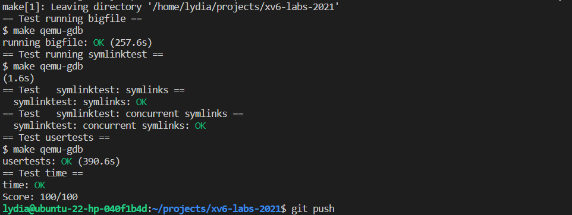

# File system

> 因时间所限，没来得及在ddl前写完完整版报告，报告缺失部分可从 https://github.com/efJerryYang/xv6-labs-2021 仓库对应目录下查看

文件系统实验主要要完成的是两个部分，一个是将原来的其中一个直接索引改为添加的一个 doubly-indirect 的索引节点，以增大单个文件的最大容量，如下图所示，之后按照这个逻辑写代码即可：

```txt
0-10: direct
11: singly indirect
12: doubly indirect

| index | addrs[i] |    singly indirect      |            doubly indirect              |
|-------|----------|-------------------------|-----------------------------------------|
|   0   |        --|--> [ data block  0 ]
|   1   |        --|--> [ data block  1 ]
|   2   |        --|--> [ data block  2 ]
|   3   |        --|--> [ data block  3 ]
|  ...  |        --|--> [ data block ...]
|   9   |        --|--> [ data block  9 ]
|  10   |        --|--> [ data block 10 ]
|  11   |        --|-->   index block 0
                        [   entry  0    ] --> [data block  11 ]
                        [   entry  1    ] --> [data block  12 ]
                        [   entry  2    ] --> [data block  13 ]
                        [   entry ...   ] --> [data block ... ]
                        [   entry 255   ] --> [data block 266 ]
|  12   |        --|-->   index block 1
                        [ entry  0   ] -->   index block 2
                                            [   entry  0    ] --> [ data block  267  ]
                                            [   entry  1    ] --> [ data block  268  ]
                                            [   entry  2    ] --> [ data block  269  ]
                                            [   entry ...   ] --> [ data block  ...  ]
                                            [   entry 255   ] --> [ data block  522  ]
                        [ entry  1   ] -->   index block 3
                                            [   entry  0    ] --> [ data block  523  ]
                                            [   entry  1    ] --> [ data block  524  ]
                                            [   entry  2    ] --> [ data block  525  ]
                                            [   entry ...   ] --> [ data block  ...  ]
                                            [   entry 255   ] --> [ data block  776  ]
                        [ entry ...  ] -->   index block ...
                                            [   entry  0    ] --> [ data block  ...  ]
                                            [   entry  1    ] --> [ data block  ...  ]
                                            [   entry  2    ] --> [ data block  ...  ]
                                            [   entry ...   ] --> [ data block  ...  ]
                                            [   entry 255   ] --> [ data block  ...  ]
                        [ entry 255  ] -->   index block 255
                                            [   entry  0    ] --> [ data block 65547 ]
                                            [   entry  1    ] --> [ data block 65548 ]
                                            [   entry  2    ] --> [ data block 65549 ]
                                            [   entry ...   ] --> [ data block  ...  ]
                                            [   entry 255   ] --> [ data block 65802 ]
```

第二个部分是添加一个符号链接，主要的整体逻辑很自然，主要遇到的问题是没有理解清楚题干给的 O_NOFOLLOW 的意思，导致代码完成之后评测始终通过不了，之后注意到问题在于没有理解 O_NOFOLLOW 是用于强调访问时不访问到最下层指向的 inode 而是直接返回当前符号链接的 inode。这个点弄清楚了之后就能跑过测试了

