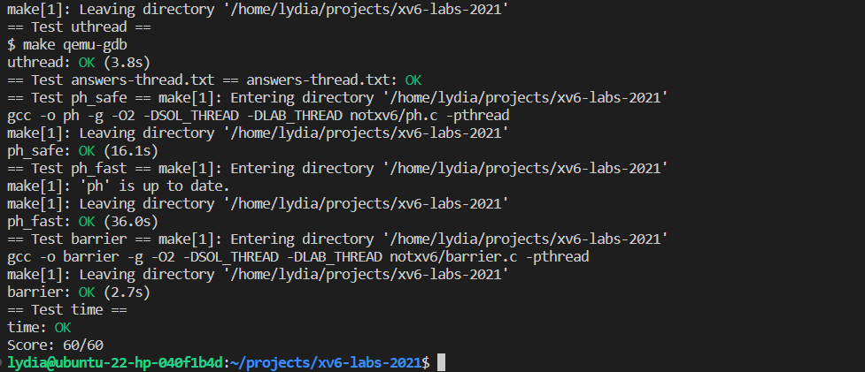

# Multithreading

## Uthread: switching between threads (moderate)

In this task, our goal is to create a user function that can support multithreading, similar to how library developers have implemented it in various programming languages. It can be challenging to handle the low-level implementation of multithreading, but for this lab, the task is relatively straightforward.

To begin, we should read through the code of several `xv6` functions, as outlined in the `xv6` book. These functions include `yield`, `sleep`, `sched`, `scheduler`, and the assembly code `swtch`. These resources will give us a good understanding of how scheduling works within the C code, which will be helpful as we start implementing this task.

The instructions provided may not be very clear, but the task itself is fairly simple to accomplish by just reading through the `uthread.c` code example.

Following the `TODOs`, our first step will be to complete the definition of `struct thread` using the following code:

<!-- This task is to implement a user function that can support multithreading, just like those programming languages library developers did. It is generally a tougth task to handle the low-level implementation of multithreading, but in this lab, the task for us is really simple.

What we should do first is to read through the code of severl xv6 function, according to the xv6 book, including `yield`, `sleep`, `sched`, `scheduler` and the assmbly code `swtch`.

These functions can give us a great understanding of how the scheduling work in the C code, so that we can start the implementation of this task.

To start with, the instructions given are not very clear but the task is quite simple to accomplish by just read througth the given code example in `uthread.c`.

Follow the TODOs, we can first complete the definition of `struct thread` with the following code: -->

```c
struct thread {
  char       stack[STACK_SIZE]; /* the thread's stack */
  int        state;             /* FREE, RUNNING, RUNNABLE */
  int        tid;               /* thread ID */
  uint64     sp;                /* saved stack pointer */
  uint64     pc;                /* saved instruction pointer */
  struct thread_context context; /* saved registers */
};
```

Some parts of the struct may seem unnecessary, such as the `tid` in my code, and the `sp` and `pc` are already saved in the `context` field of type `struct thread_context`, which has a similar definition to that of the `struct context` used for processes, but we just forgot to update the redundant parts and it does not affect the program's execution. For the `context`, in fact, we can simply copy the definition from `struct context` to `thread_context`.

The code for `thread_schedule` looks similar to the `scheduler` used for process scheduling, so we can modify it in a similar way. To switch between threads, we need to implement the `thread_switch` function, which is defined in `uthread_switch.S`. We can easily update the assembly code by copying the code from `swtch.S`, which handles context switching for processes. Since we already copied the structure of the `context` in the previous step, the implementation should be similar.

Finally, we just need to initialize a newly created thread, which involves two parts: initializing the thread's `stack` and initializing the thread's `context`. In this implementation, the thread's stack is contained within the thread's structure, which makes it easier to control the thread.

To initialize the thread's `context`, we set the stack pointer (`sp`) to the top of the stack and the program counter (`pc`) to the function `func` that will be executed by the thread.
<!-- Although some parts of the struct are redundant, like the `tid` in my code is not used, the `sp` and `pc` have already saved in the `context` of type `struct thread_context`, it can work. The definition of the `struct thread_context` is similar to that of process's `struct context` - actually we can just copy the definition from `struct context` to `thread_context`.

Next, when we look into the code of `thread_schedule`, it seems quite similar to the scheduler in process scheduling, so we can modify the code here in a similar way. We should switch between threads, so we should implement the `thread_switch` function. As it is defined in the `uthread_switch.S`, we should update the assembly code. Actually, it is easy because we can just copy the code from `swtch.S` which is for process context switch, and because we copied the structure of context in previous step, we can do it here the same way.

Finally, what we should do is only the initialization of a newly created thread. This includes two parts: initialize the thread's stack and initialize the thread's context. The thread's stack in this implementation is contained in a thread's structure, which is simpler for us to implement thread control.

Here, we set the stack pointer (`sp`) pointing to the top of the stack and the program counter (`pc`) pointing to the function `func` that is going to be executed in a thread. -->

```c
  t->sp = (uint64)&t->stack[STACK_SIZE];
  t->pc = (uint64)func;
```

To complete the initialization of the thread's `context`, we need to initialize the `sp` and `pc` again (due to the initial redundant design) and the other callee-save registers (`s0-s11`). After doing this, the task is finished.
<!-- Then, initialize the thread's context by initialize the sp and pc again (because of the redundant design at first...), and the other calle-save registers (`s0-s11`). Then the task is completed. -->

## Using threads (moderate)

The tasks at hand are not labs for the xv6 operating system, but rather programs that run directly on the host machine.

Our goal is to improve the performance of filling and updating the hash table using multithreading in C. The original code works correctly when run with one thread, but there are issues when using multiple threads. Our task is to resolve these issues and optimize the process using multithreading techniques.

<!--
This task and the next one are not labs working on xv6 operating system but directly runs on the host machine.

The goal is to speed up the procedure of filling and updating the hash table using multithreading technique in C. The original code example can correctly run in 1 thread, but will cause problems when running with multiple thread. -->

### Question

The lab website poses a question about the problem. The answer to this question can be found below:

1. **Why are there missing keys with 2 threads, but not with 1 thread? Identify a sequence of events with 2 threads that can lead to a key being missing. Submit your sequence with a short explanation in answers-thread.txt**

If multiple threads execute the program, race conditions may occur due to the lack of locks on the hash table when threads access it simultaneously. This can lead to conflicting updates and unpredictable behavior, such as when multiple threads try to insert or update entries in the table at the same time.

For example, consider a scenario where `thread 0` and `thread 1` both try to add a key-value pair to `bucket 0`. It may be difficult to determine what happened during the insert process, which could potentially result in many entries being lost from the linked entry list.

For instance, suppose the hash table initially has the following structure:
<!--
If there are multiple threads executing the program, race conditions may occur.

That's because there is no locks for the hash table to be held when threads are visiting at the same time.

When multiple threads try to access and modify shared data simultaneously, conflicting updates and unpredictable behavior may happen. (insert & update entries at the same time)

For example, if thread 0 and thread 1 both try to add a key-value pair to bucket 0. When executing the program, it is hard to say what was happenning during the insert process, which would probably cause the linked entry list lost many of the entries on the list.

Let's say, the hash table originally has the structure below: -->

```txt
index  pointers   entries
  0    [   --]--> [(k1, v1), --]--> [(k2, v2), --]--> NULL
  1    [   --]--> NULL
 ...
```

Now, let's say that `thread 0` tries to insert a key-value pair `(k3, v3)` into `bucket 0`, while `thread 1` also wants to insert a key-value pair `(k4, v4)` into the same bucket. If `thread 0` enters the insert function first and executes up to the line `e->next = n;` before the entry pointer is updated to link to the newly inserted entry struct, then `thread 0` may switch to `thread 1`, which also enters the insert function and successfully updates the entry pointer to point to the entry with key pair `(k4, v4)`.
<!--
Now, t0 try to insert a key-value pair (k3, v3) into bucket 0, while t1 also want to insert a key-value pair (k4, v4) into bucket 0. Assuming that t0 first enter the `insert` function, executing to the line `e->next = n;` just before the entry pointer being updated to link to the newly inserted entry struct. Then t0 swtich to t1, also executing into the `insert` function, but successfully updated the entry pointer to point to the entry with key pair (k4, v4). -->

As a result, the structure of the first bucket would look like this:
<!-- Now, the structure of the first bucket would look like this: -->

```txt
  0    [   --]--> [(k4, v4), --]--> [(k2, v2), --]--> NULL
                                    ^
                                    |
                                    |
                    [(k3, v3), --]--+
```

When the switch back to `thread 0` and it continues executing the code `*p = e`, it could cause the entry `[(k4, v4), ----]---->` to be lost. This is the cause of missing keys in this program.

To solve this issue, we can add a lock to each bucket to prevent race conditions. This way, multiple threads can work concurrently on different buckets without causing missing entries. Different approaches can be taken to implement this solution, but the provided lock and unlock statements make it easy to implement this task.
<!-- Solutions to it can vary according to different scheme applied to this situation, but according to the given lock and unlock statements, we can easily add a lock to each bucket to avoid such race conditions. In this way, multiple thread can work concurrently on multiple bucket while not casusing the issuse of missing entries. -->

### Implementation

As we have previously discussed, the solution to this issue is straightforward: we can add a lock to each hash bucket to prevent race conditions. The provided instructions include some functions from `pthread.h` that can manage locks, and we can refer to the manual to learn how to use them.
<!-- According to what we have answered, the solutions is intuitive, that we can add a lock to each of the hash bucket. The instructions provide some functions in `pthread.h` that can manage a lock, and we can refer to the manual to learn their usage. -->

```c
pthread_mutex_t lock;            // declare a lock
pthread_mutex_init(&lock, NULL); // initialize the lock
pthread_mutex_lock(&lock);       // acquire lock
pthread_mutex_unlock(&lock);     // release lock
```

To implement this solution, we need to initialize the `locks` array and do so in the `main` function. Remember to also destroy the locks at the end of the `main` function.

<!-- To accomplish this, we need to intialize `locks` array, and initialize it in the `main` function and also remember to distroy it at the end of `main` function: -->

```c
pthread_mutex_t locks[NBUCKET]; // This is a global mutex locks array

...
// other part of code
...

int
main(int argc, char *argv[])
{
  pthread_t *tha;
  void *value;
  double t1, t0;

  for (int i = 0; i < NBUCKET; i++) {
    pthread_mutex_init(&locks[i], NULL); // initialize each lock
  }

  ...
  // other part of code
  ...

  for (int i = 0; i < NBUCKET; i++) {
    pthread_mutex_destroy(&locks[i]); // destroy each lock
  }
}
```

Then, we can add a lock corresponding to the computed hash index by adding a lock after this line `int i = key % NBUCKET;` in the `put` function, which is the point where race conditions may occur. The updated `put` function would look like this:
<!-- Next, we need to add a lock according to the computed hash index, so we just need to add a lock after this line `int i = key % NBUCKET;` in the `put` function where we may occured race conditions. The updated `put` function is as below: -->

```c
static
void put(int key, int value)
{
  int i = key % NBUCKET;

  pthread_mutex_lock(&locks[i]);
  // is the key already present?
  struct entry *e = 0;
  for (e = table[i]; e != 0; e = e->next) {
    if (e->key == key)
      break;
  }
  if(e){
    // update the existing key.
    e->value = value;
  } else {
    // the new is new.
    insert(key, value, &table[i], table[i]);
  }

  pthread_mutex_unlock(&locks[i]);
}
```

After making these modifications, the tests should pass.
<!-- And then the test passed after these modifications. -->

## Barrier(moderate)

This task also introduces some functions from `pthread.h` that can manage conditional waiting and broadcasting for threads.

<!-- This task also introduces some of the functions in the `pthread.h`, that can manage the conditional wait and broadcast for threads. -->

```c
pthread_cond_wait(&cond, &mutex);  // go to sleep on cond, releasing lock mutex, acquiring upon wake up
pthread_cond_broadcast(&cond);     // wake up every thread sleeping on cond
```

We only need to implement the `barrier` function, which should allow all threads to wait at certain points and resume when a certain condition is satisfied.
<!-- The only function we need to implement is the `barrier` - we need to successfully allow all the thread wait at some points and restart when a condition is satisfied. -->

```c
static void
barrier()
{
  pthread_mutex_lock(&bstate.barrier_mutex);
  bstate.nthread++;
  while(bstate.nthread != nthread && bstate.nthread != 0){
    pthread_cond_wait(&bstate.barrier_cond, &bstate.barrier_mutex);
  }
  if (bstate.nthread == nthread) {
    pthread_cond_broadcast(&bstate.barrier_cond);
    bstate.nthread = 0;
    bstate.round++;
  }
  pthread_mutex_unlock(&bstate.barrier_mutex);
}
```

The code for the `barrier` function is straightforward. When a thread enters the `barrier` from outside, we add a lock and increase the number of threads recorded in the global `bstate.nthread`. There are two conditions that the waiting loop must satisfy:

1. If the number of threads reaches `nthread`, the waiting loop should be skipped and the first thread to reach the code line after the while loop should be responsible for broadcasting to the other threads and starting the next round. The `bstate.nthread` should also be reset to zero.
2. When other threads are awoken by the thread that skips the while loop, they should be able to leave the loop. However, if `bstate.nthread` has already been updated by the last thread, the other threads may not leave the loop if we don't add the condition `bstate.nthread != 0`.

However, the code above has a bug that can cause a deadlock when we run the program with multiple threads. To debug this issue, we can print out the execution sequence of a deadlock session and manually walk through it step by step as follows:
<!-- The code here is also intuitive, we add a lock whenever a thread enter the `barrier` from outside, and increase the number of thread recorded in the global `bstate.nthread`. There are two types of condition this waiting condition should satisfy:

1. If the numebr of thread reaches the `nthread`, the waiting loop should be skipped, and the first thread that visit the code line after the while loop should be responsible for broadcasting the other thread and start the next round as well as reset the `bstate.nthread` to zero.
2. When other threads are waken up by the thread that skips the while loop, they should be able to leave the while loop, but the `bstate.nthead` has already be updated by the last thread, so if not adding the `bstate.nthread != 0` condition, the other threads may never leave the while loop.

However, the above code does contain a bug, which would cause a deadlock when we run the program with multiple threads. The cause do let us debug for a while - we print out the execution sequence of a deadlock session, and walk through it manually step by step in the following ways: -->

```c
Analysis of a deadlock in the barrier() function.

The deadlock occurs when the last thread to reach the barrier is the last thread to exit the while loop.
Terminal output:
 ==================== Entering barrier() ===  // Thread 0 enters barrier
 nthread = 0, round = 0                       // Thread 0 acquires lock
 Entering cond_wait:                          // Thread 0 enters cond_wait
   nthread = 1, round = 0                     // Thread 0 releases lock and waits
 ==================== Entering barrier() ===  // Thread 1 enters barrier
 nthread = 1, round = 0                       // Thread 1 acquires lock
 Exited while loop:                           // Thread 1 skips cond_wait
   nthread = 2, round = 0
 Broadcasting...                              // Thread 1 broadcasts
 Broadcasted!
 ==================== Exiting barrier() ====  // Thread 1 exits barrier, releases lock
 Exiting cond_wait:                           // Thread 0 wakes up, acquires lock
   nthread = 0, round = 1
 Exited while loop:                           // Thread 0 satisfies while loop condition and exits
   nthread = 0, round = 1
 ==================== Exiting barrier() ====  // Thread 0 exits barrier, releases lock
 ==================== Entering barrier() ===  // Thread 0 enters barrier
 nthread = 0, round = 1                       // Thread 0 acquires lock
 Entering cond_wait:                          // Thread 0 enters cond_wait
   nthread = 1, round = 1                     // Thread 0 releases lock and waits
 ==================== Entering barrier() ===  // Thread 1 enters barrier
 nthread = 1, round = 1                       // Thread 1 acquires lock
 Exited while loop:                           // Thread 1 skips cond_wait
   nthread = 2, round = 1
 Broadcasting...                              // Thread 1 broadcasts
 Broadcasted!
 ==================== Exiting barrier()  ===  // Thread 1 exits barrier, releases lock
 ==================== Entering barrier() ===  // Thread 1 enters barrier
 nthread = 0, round = 2                       // Thread 1 acquires lock
 Entering cond_wait:                          // Thread 1 enters cond_wait
   nthread = 1, round = 2
 Exiting cond_wait:         // Bugs here, if a thread broadcasted
                            // other threads and then raced in the next round
   nthread = 1, round = 2   // and reached the barrier before the last thread
                            // exited the while loop, the last thread
 Entering cond_wait:        // would be stuck in the cond_wait.
   nthread = 1, round = 2
```

Upon further examination, we discover that there is still a possibility for deadlock, as mentioned in the instructions (which we didn't fully understand at first):

> "You have to handle the case in which one thread races around the loop before the others have exited the barrier. In particular, you are re-using the bstate.nthread variable from one round to the next. Make sure that a thread that leaves the barrier and races around the loop doesn't increase bstate.nthread while a previous round is still using it. "

This means that if a thread broadcasts to the other threads and then races into the next round and reaches the `while` loop in the `barrier` function before the last thread exits the `while` loop, the last thread could get stuck in the `cond_wait`.

To fix this issue, we can simply add a local variable `current_round` to temporarily store the round number that the thread enters the `while` loop. When the thread is awoken by another thread, it should first check the round number and, if it has changed (indicating that the next round has started before the thread has exited the `while` loop), it should just `break` out of the loop.

After making this modification, all tests should pass.
<!-- And we discover that there is still a possibility that cause deadlock which has been already mentioned in the instructions (which we did not fully understand at first):

> "You have to handle the case in which one thread races around the loop before the others have exited the barrier. In particular, you are re-using the bstate.nthread variable from one round to the next. Make sure that a thread that leaves the barrier and races around the loop doesn't increase bstate.nthread while a previous round is still using it. "

That means, if a thread broadcasted other threads and then raced in the next round and reached the barrier `while` loop before the last thread exited the `while` loop, the last thread would be stuck in the cond_wait.

So, we can simply add a local variable `current_round` to temporarily store the round number that the thread enter the while loop. When the thread is waken up by other thread, it should first check the round number, and if it has changed, which means the next round has started before it leaves the while loop, it should just `break` the loop.

After the modification applied, all tests passed. -->

## Make grade



## Reference

1. [Xv6 Book Chapter 7: Scheduling](https://pdos.csail.mit.edu/6.828/2021/xv6/book-riscv-rev2.pdf)
2. [MIT 6.S081 Lab: Multithreading](https://pdos.csail.mit.edu/6.828/2021/labs/thread.html)
3. [Integer Calling convention](https://tclin914.github.io/77838749/)
4. [Lock and Unlock A Mutex](https://pubs.opengroup.org/onlinepubs/007908799/xsh/pthread_mutex_lock.html)
5. [Initialise or Destroy A Mutex](https://pubs.opengroup.org/onlinepubs/007908799/xsh/pthread_mutex_init.html)
6. [Thread Creation](https://pubs.opengroup.org/onlinepubs/007908799/xsh/pthread_create.html)
7. [Wait on A Condition](https://pubs.opengroup.org/onlinepubs/007908799/xsh/pthread_cond_wait.html)
8. [Signal or Broadcast A Condition](https://pubs.opengroup.org/onlinepubs/007908799/xsh/pthread_cond_broadcast.html)
