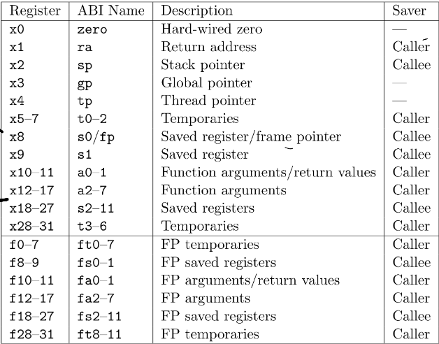
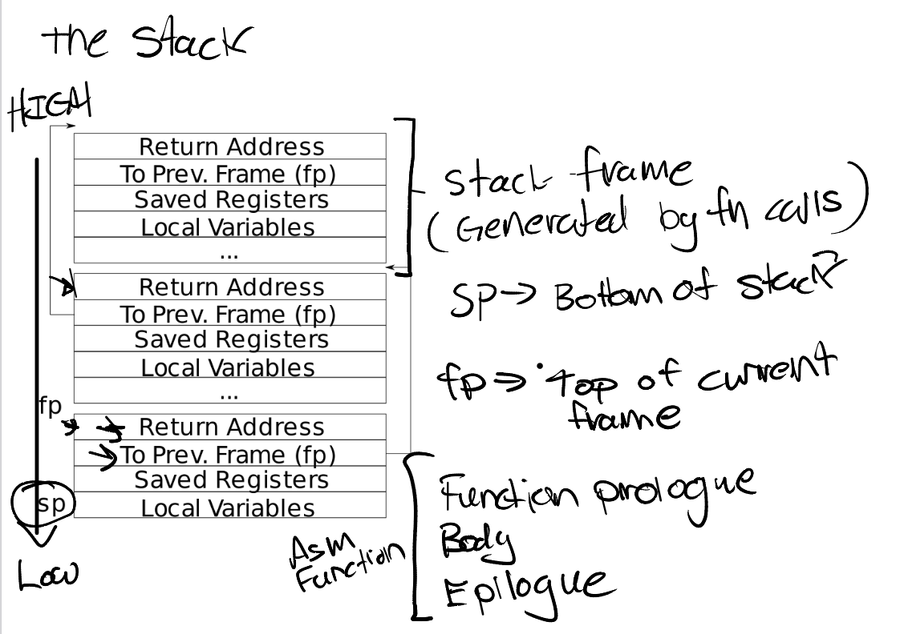
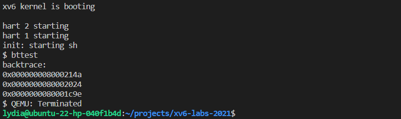
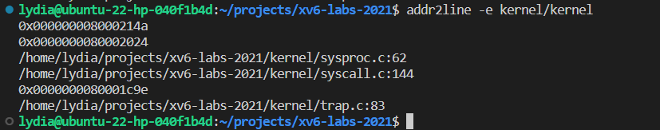
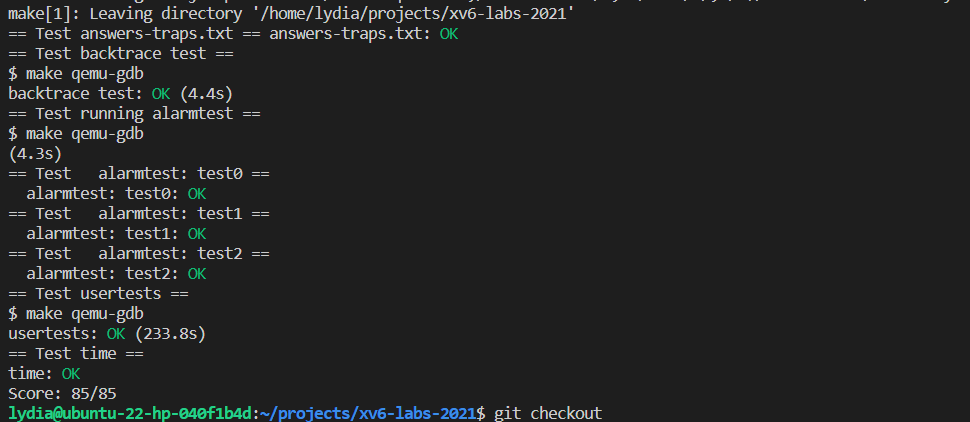

# Traps

## RISC-V assembly (easy)

1. **Which registers contain arguments to functions? For example, which register holds 13 in main's call to printf?**

    According to the RISC-V calling convention, arguments to functions are typically passed in registers `a0-a7`. In the `main` function's call to `printf`, the argument `13` is passed in register `a2`. You can refer to the official RISC-V manual or the diagram I provided for more information on the convention for using registers.

    

2. **Where is the call to function f in the assembly code for main? Where is the call to g? (Hint: the compiler may inline functions.)**

    ```S
    # in the main function
    printf("%d %d\n", f(8)+1, 13);
    24: 4635                 li     a2,13
    26: 45b1                 li     a1,12
    28: 00000517             auipc  a0,0x0
    2c: 7b050513             addi   a0,a0,1968 # 7d8 <malloc+0xe8>
    30: 00000097             auipc  ra,0x0
    34: 608080e7             jalr   1544(ra) # 638 <printf>
    ```

    In the `main` function, the call to function `f` is found as the instruction `28: 00000517             auipc  a0,0x0`, which loads the address of `f` into register `a0` and prepares to jump to it. However, the call to `f` has been optimized by the compiler and inlined into a single instruction, `26: 45b1                 li     a1,12`, which loads the immediate value `12` into register `a1`. This value represents the result of calling `f(8)+1`, as indicated by the `printf` statement.
    <!-- According to the code above, the call for function `f` is simplified to the `26: 45b1                 li     a1,12` instruction, which directly compute the result of `f(8)+1` during compilation. -->

    The call to function `g` is similarly inlined and optimized by the compiler. In the original definition of function `f`, the call to `g` appears as the instruction `14: 250d                addiw a0,a0,3`, which adds the immediate value `3` to the value in register `a0`. However, this call has benn inlined and simplified to a load-immediate instruction `li a1,12`, as inferred from the difinition of function `f`.
    <!-- For the call to g, based on the definition of function `f`, we can infer that it is inlined by compiler and the procedure of function calls is optimized and simplified to a load-immediate instruction `li    a1,12`. -->

    Below are the declarations of function `g` and `f`, and the original call for function `g` is in the definition of function `f`.

    ```S
    0000000000000000 <g>:

    int g(int x) {
    0: 1141                 addi  sp,sp,-16
    2: e422                 sd    s0,8(sp)
    4: 0800                 addi  s0,sp,16
    return x+3;
    }
    6: 250d                 addiw a0,a0,3
    8: 6422                 ld    s0,8(sp)
    a: 0141                 addi  sp,sp,16
    c: 8082                 ret

    000000000000000e <f>:

    int f(int x) {
    e: 1141                 addi  sp,sp,-16
    10: e422                sd    s0,8(sp)
    12: 0800                addi  s0,sp,16
    return g(x);
    }
    14: 250d                addiw a0,a0,3
    16: 6422                ld    s0,8(sp)
    18: 0141                addi  sp,sp,16
    1a: 8082                ret
    ```

3. **At what address is the function printf located?**

    ```S
    0000000000000638 <printf>:

    void
    printf(const char *fmt, ...)
    {
     638: 711d                   addi  sp,sp,-96
     63a: ec06                   sd    ra,24(sp)
     63c: e822                   sd    s0,16(sp)
     63e: 1000                   addi  s0,sp,32
     ...
     662: dce080e7               jalr  -562(ra) # 42c <vprintf>
    }
     666: 60e2                   ld    ra,24(sp)
     668: 6442                   ld    s0,16(sp)
     66a: 6125                   addi  sp,sp,96
     66c: 8082                   ret
    ```

    The function `printf` is located at address `0x0000000000000638` in the assembly code of `call.asm`. It's important to note that the absolute address of a function may change depending on the structure and content of the program. For example, before working on the traps lab, the address of `printf` was `0x0000000000000628` on my machine rather than the current address shown in the code.

4. **What value is in the register ra just after the jalr to printf in main?**

    After the `jalr` instruction at address `0x34`, the value in register `ra` will be the address of the instruction immediately following the `jalr` instruction. In this case, the address of the instruction following the `jalr` instruction should be `0x38`, so the value in register `ra` will be `0x38`.

5. **Run the following code.**

    ```c
    unsigned int i = 0x00646c72;
    printf("H%x Wo%s", 57616, &i);
    ```

    **What is the output? Here's an ASCII table that maps bytes to characters.**

    **The output depends on that fact that the RISC-V is little-endian. If the RISC-V were instead big-endian what would you set i to in order to yield the same output? Would you need to change 57616 to a different value?**

    The output of the code should be `He110 World` because the integer value `57616` is stored in little-endian format as the bytes `72`, `6c`, and `64`, which correspond to the ASCII characters `'r'`, `'l'`, and `'d'`, respectively. In little-endian architecture, the lowest-order byte (the rightmost digit in the hexadecimal representation) is stored at the lowest memory address.
    <!-- The original output shoule be `He110 World`, because in little-endian architecture, the integer will be stored as `72 6c 64` from lowest bit to the highest bit, which stands for `r l d` in ASCII representation string, and `hex(57616) = 0xe110`, so that the output should be `He110 World`. -->

    If the RISC-V were instead big-endian, the integer value `57616` would be stored as the bytes `64`, `6c`, and `72`, which would correspond to the ASCII characters `'d'`, `'l'`, and `'r'`, respectively. In this case, to yield the same output as in little-endian architecture, you would need to set i to the value `0x00726c64`. This value would be stored as the bytes `72`, `6c`, and `64`, which would correspond to the ASCII characters `'r'`, `'l'`, and `'d'`. There is no need to change the value of `57616`, as it would be printed as the same hexadecimal value as it is, regardless of the endianness of the architecture.
    <!-- If the RISC-V were big-endian, `i` should be set as `0x00726c64` so that the value from lowest bit to the highest bit would remain `72 6c 64` to represent `r l d` in ASCII string. There is no need to change `57616` to a different value, because the hexadecimal value of it would stay the same. -->

6. **In the following code, what is going to be printed after 'y='? (note: the answer is not a specific value.) Why does this happen?**

    ```c
    printf("x=%d y=%d", 3);
    ```

    In the given code, after the string "y=" is printed, there might not be a value displayed or an arbitrary value, because there is only one argument provided to the `printf` function, which corresponds to the format specifier `%d` for the first integer value.

    The second format specifier `%d` has no corresponding argument, so the behavior of the `printf` function is undefined. This means that the output of this code could vary depending on how the compiler handles the situation. It is possible that the value of the unassigned register `a2` could be used as the second argument, resulting in an arbitrary value being printed. Alternatively, the compiler may simply ignore the second format specifier and not print anything after "y=".
    <!-- It depends on how the compiler handle the undefined condition. It might be the value of a2 which is not assigned but may contain value, so that the result may be arbitrary. Or the compiler may just ignore the unspecified value here, so there may be no value displayed here. -->

## Backtrace (moderate)



To print the saved return address, according to the stack frame of xv6 operating system shown above, we can walk up the stack by iteratively updating the value of the frame pointer (`fp`).
<!-- According to the stack frame of xv6 os above, what we should do is to walk up the stack and print the saved return addresses by updating the value of `fp` (frame pointer) iteratively. -->

One way to do this is to use inline assembly to fetch the values of `sp` and `fp`:
<!-- The intuitive way of achieving this is by writing the inline assembly code to fetch the value from specific registers, like: -->

```s
asm volatile("mv %0, sp" : "=r" (sp));
asm volatile("mv %0, fp" : "=r" (fp));
```

However, the xv6 operating system provides encapsulations for inline assembly, so we can instead use the functions `r_fp()` and `r_sp()` to indirectly retrieve the values of these registers.
<!-- However, there is some encapsulations provided for inline assembly use in xv6, so we don't need to write assembly directly, and we can call the function `r_fp()` and `r_sp()` in an indirect way to get the value from specific registers. -->

To ensure that we only access valid memory during the `backtrace`, we need to limit the range of the `fp` value to within the page of the stack pointer (`sp`) points to. This can be done by setting the range of `fp` to `PGROUNDDOWN(sp) < fp && fp < PGROUNDUP(sp)`.
<!-- Moreover, we need to limit the walk range to only one page, or the frame pointer will let us visit some invalid memery parts when backtracing. Due to the `fp` and `sp` should be in the same page, we can easily restrict the `fp` range to `PGROUNDDOWN(sp) < fp && fp < PGROUNDUP(sp)` to guarantee the validancy of `fp`. -->

To retrieve the value of the return address (`ra`) at the current stack frame, we can use the following code: `ra = *(uint64*)(fp - 8);`. To move to the next stack frame, we can update the value of `fp` like this: `fp = *(uint64*)(fp - 16)`.
<!-- According to the stack structure, the value we need to print, `ra`, is just under where `fp` placed, so we can get the value of `ra` in current stack with this code: `ra = *(uint64*)(fp - 8);`. And because we need to walk up the stack in the loop, we need to update the fp in this way: `fp = *(uint64*)(fp - 16)`. -->

Based on these steps, the `backtrace` function can be implemented as follows:
<!-- So the `backtrace` function should look like this: -->

```c
void backtrace(void) {
  uint64 fp = r_fp();
  uint64 sp = r_sp();
  printf("backtrace:\n");
  while(PGROUNDDOWN(sp) < fp && fp < PGROUNDUP(sp)) {
    uint64 ra = *(uint64*)(fp - 8);
    printf("%p\n", ra);
    fp = *(uint64*)(fp - 16);
  }
}
```

Alternatively, the `while` loop can be replaced with a `for` loop like this:

```c
void backtrace(void) {
  uint64 sp = r_sp();
  uint64 fp = r_fp();
  for (fp; PGROUNDDOWN(sp) < fp && fp < PGROUNDUP(sp); fp = *(uint64*)(fp - 16)) {
    uint64 ra = *(uint64*)(fp - 8);
    printf("%p\n", ra);
  }
}
```

To insert the `backtrace` function into the appropriate locations, we can follow the instructions provided [here](https://pdos.csail.mit.edu/6.828/2021/labs/traps.html). In particular, we can add the `backtrace` function to the `sys_sleep` function to pass the test and to the `panic` function to assist with debugging later code.
<!-- Next, we just need to follow the instructions given in website [here](https://pdos.csail.mit.edu/6.828/2021/labs/traps.html) to insert the backtrace function to appropriate places, including `sys_sleep` to pass the test and to `panic` to help debug later code. -->

The `bttest` passed, and the output of `addr2line` is as follows:

```sh
xv6 kernel is booting

hart 1 starting
hart 2 starting
init: starting sh
$ bttest
backtrace:
0x000000008000214a
0x0000000080002024
0x0000000080001c9e
```

<!--  -->

```sh
lydia@ubuntu-22-hp-040f1b4d:~/projects/xv6-labs-2021$ addr2line -e kernel/kernel
0x000000008000214a
0x0000000080002024
/home/lydia/projects/xv6-labs-2021/kernel/sysproc.c:62
/home/lydia/projects/xv6-labs-2021/kernel/syscall.c:144
0x0000000080001c9e
/home/lydia/projects/xv6-labs-2021/kernel/trap.c:83
```

<!--  -->

## Alarm (hard)

To implement the alarm functionality, the first step is to add the system calls `sigalarm` and `sigreturn` according to the instructions on the [website](https://pdos.csail.mit.edu/6.828/2021/labs/traps.html).
<!-- The first step to start is add the corresponding system calls `sigalarm` and `sigreturn` according to the instructions on the [website](https://pdos.csail.mit.edu/6.828/2021/labs/traps.html). -->

The syscall definitions for `sigalarm` and `sigreturn` are shown below. These syscalls were added to the `sysproc.c` file:

```c
uint64 sys_sigalarm(void) {
  struct proc *p = myproc();
  int n;
  uint64 addr;
  if(argint(0, &n) < 0)
    return -1;
  if(argaddr(1, &addr) < 0)
    return -1;
  if(p->handling_signal == 1 || p->in_a_handler == 1)
    return -1;
  p->alarm_interval = n;
  // printf("alarm_interval: %d\n", p->alarm_interval);
  p->handler = (void *) addr; // syntax of casting a function pointer is like (void (*)()) ptr, but here, it is okay to write code in my way
  p->handling_signal = 1;
  if (addr == 0)
    p->handler_not_null = 0;
  else
    p->handler_not_null = 1;
  // printf("handler: %p\n", p->handler);
  return 0;
}

uint64 sys_sigreturn(void)
{
  return 0;
}
```

A key part of implementing `test0` in `alarmtest` is handling the case of a zero address function `periodic`. I tried several approaches to achieve this, including using function pointers or inline assembly, or casting the function pointer in an indirect way. However, all of these attempts failed because a process cannot visit address `0x0`, which is generally reserved and not intended for use. These attempts resulted in a kernel trap with an error message indicating that the instruction address zero could not be visited, and produced the following panic information:
<!-- However, the core of `test0` in the `alarmtest` is the method to handle the zero address function. I have attempted many methods to achieve this, including intuitive ways like using function pointer or inline assembly, or casting the function pointer from indirect way, but all of them failed. Process just cannot visit address 0x0 which is just invalid for most cases, reserved and should not be used, those attemps just went into a kernal trap with error message to tell me it failed when visiting the instruction address zero and yield the following panic information: -->

```sh
xv6 kernel is booting

hart 1 starting
hart 2 starting
init: starting sh
$ alarmtest
test0 start
..........scause 0x000000000000000c
sepc=0x0000000000000000 stval=0x0000000000000000
panic: kerneltrap
backtrace:
0x0000000080005c68
0x0000000080001e02
0x0000000080005024
[Ctrl+A] [X]
```

The hint provided in the question suggests the correct method for determining the instruction address at which user-space code resumes execution after a trap on the RISC-V returns to user space. To do this, we can simply add an assignment statement that copies the target instruction address to the register of the current program counter (instruction pointer), like this: `p->trapframe->epc = (uint64) p->handler;`. With this modification, the code should pass the `test0` test.

<!-- Fortunately, there is a hint that implied the correct method:

> When a trap on the RISC-V returns to user space, what determines the instruction address at which user-space code resumes execution?

So, the correct one is quite simple, just add an assignment statement to copy the target instruction address to the register of current program counter (instruction pointer) like this `p->trapframe->epc = (uint64) p->handler;`. And the following code gives the code that pass `test0`: -->

```c
  // in file trap.c, function usertrap()
  ...
  // give up the CPU if this is a timer interrupt.
  if(which_dev == 2) {
    p->ticks_count++;
    if (p->ticks_count >= p->alarm_interval && p->alarm_interval != 0) {
      p->ticks_count = 0;
      // problem is caused by executing the handler with address 0 (sepc=0x0000000000000000)
      if (p->handler != 0){
        ((void (*)()) p->handler)();
      } else {
        //  ((void (*)()) p->handler)();
        // call a function at address zero using asm
        // asm("jalr zero, 0(zero)");
        // asm volatile("jalr x0");
        p->trapframe->epc = (uint64) p->handler;
      }
    }
    yield();
  }
  ...
```

However, the code currently fails in the `test1` and `test2` tests. We will need to fix these bugs in the following steps. The failure information for these tests can be seen in the output.
<!-- Notice, currently the code fails in `test1` and `test2`, and we will fix the bugs in the following steps. The failure information looks like this: -->

```sh
xv6 kernel is booting

hart 1 starting
hart 2 starting
init: starting sh
$ alarmtest
test0 start
........alarm!
test0 passed
test1 start
.alarm!
.alarm!
.alarm!
.alarm!
.alarm!
alarm!
.alarm!
.alarm!
.alarm!
.alarm!

test1 failed: foo() executed fewer times than it was called
test2 start
........scause 0x000000000000000c
sepc=0x000000000000003a stval=0x000000000000003a
panic: kerneltrap
backtrace:
0x0000000080005c68
0x0000000080001e04
0x0000000080005024
[Ctrl+A] [X]
```

To fix these issues, we should follow the instructions provided by the course website to implement our code. These instructions tell us that we should save the appropriate registers to handle the traps correctly. However, the instructions also note that "(Hint: it will be many)", indicating that we may easily miss some necessary registers.
<!-- Next, we should follow the instructions provided by 6.S081 to implement our code. The instructions tell us we should save appropriate registers to handle this. However, it also says "(Hint: it will be many)" indicating that it will be easy to miss some necessary registers. -->

To simplify the process, we can just copy all of the registers from the `trapframe`, and restore them all when we return, like this:
<!-- So to simplify the process, we can just copy all the registers from trapframe, and restore them all when we return, like this: -->

```c
// in file trap.c, function usertrap()
  ...
  // give up the CPU if this is a timer interrupt.
  if(which_dev == 2) {
    p->ticks_count++;
    if (p->ticks_count >= p->alarm_interval && p->alarm_interval != 0) {
      p->ticks_count = 0;
      if (p->handler != 0){
        ((void (*)()) p->handler)();
      } else {
        // save running states
        p->old_trapframe = (struct trapframe *)kalloc();
        memmove(p->old_trapframe, p->trapframe, sizeof(struct trapframe));
        p->old_alarm_interval = p->alarm_interval;
        p->old_ticks_count = p->ticks_count;
        p->old_handling_signal = p->handling_signal;
        p->old_handler_not_null = p->handler_not_null;
        p->old_handler = p->handler;
        // copy the target instruction address to pc
        p->trapframe->epc = (uint64) p->handler;
      }
    }
    yield();
  }
  ...
```

Additionally, when we return from the trap, we should free any allocated memory and restore the process to its running state.
<!-- Also, we need to free the allocated memory and restore the process running states when return: -->

```c
// in file sysproc.c
uint64 sys_sigreturn(void)
{
  struct proc *p = myproc();
  if(p->handling_signal == 0)
    return -1;
  p->handling_signal = 0;
  p->alarm_interval = 0;
  p->handler = 0;
  if (p->handler_not_null == 0) {
    // means that the handler was null
    // so we need to restore the old trapframe
    memmove(p->trapframe, p->old_trapframe, sizeof(struct trapframe));
    kfree(p->old_trapframe);
    p->old_trapframe = 0;
    p->alarm_interval = p->old_alarm_interval;
    p->handler_not_null = p->old_handler_not_null;
    p->handler = p->old_handler;
    p->handling_signal = p->old_handling_signal;
  }
  return 0;
}
```

After making these changes and running the `alarmtest` program, we should see that `test1` has passed. However, the program will still fail when running `test2`. The terminal output for this test should look like:
<!-- Now, run the `alarmtest`, we can see `test1 passed` but the program still fails in running `test2`, the terminal output should be: -->

```sh
xv6 kernel is booting

hart 2 starting
hart 1 starting
init: starting sh
$ alarmtest
test0 start
..........alarm!
test0 passed
test1 start
..alarm!
.alarm!
.alarm!
..alarm!
..alarm!
.alarm!
alarm!
.alarm!
.alarm!
..alarm!
test1 passed
test2 start
.........scause 0x000000000000000c
sepc=0x000000000000003a stval=0x000000000000003a
panic: kerneltrap
backtrace:
0x0000000080005d48
0x0000000080001e48
0x0000000080005104
[Ctrl+A] [X]
```

The instructions provided by course website tell us about the cause of this failure in `test2`:

> "Prevent re-entrant calls to the handler----if a handler hasn't returned yet, the kernel shouldn't call it again. test2 tests this."

To fix this issue, we need to mark whether the process is currently handling a timer interrupt. If it is, we should ignore any additional timer interrupts until the current one has returned. Since the instructions do not specify how we should handle the timer when we are in a timer interrupt, we can leave the original implementation unchanged.

We can achieve this by adding a field to the `struct proc` to mark the current running state of the process. For example, we can add a `in_a_handler` tag to mark whether the process is currently handling a timer interrupt.

To modify the `sys_return` syscall to account for this, we can do the following:
<!-- Don't worry, the instructions given in 6.S081 tell us about the cause that would fail `test2`:

> Prevent re-entrant calls to the handler----if a handler hasn't returned yet, the kernel shouldn't call it again. test2 tests this.

So what we should do is to mark whether the process is handling a timer interrupt, if it is doing so, just ignores another timer interrupt untill it returns. As the instructions do not restrict how we count the timer when we still in a timmer interrupt, we can just leave the original implement not changed. It is easy to achieve by adding a field to the struct proc again, here we can just add a `in_a_handler` tag to mark current running state of whether it is handling a timer interrupt.

And we should modify the `sys_return` syscall in the following way: -->

```c
uint64 sys_sigreturn(void)
{
  struct proc *p = myproc();
  if(p->handling_signal == 0)
    return -1;
  p->handling_signal = 0;
  p->alarm_interval = 0;
  p->handler = 0;
  // restore
  memmove(p->trapframe, p->old_trapframe, sizeof(struct trapframe));
  kfree(p->old_trapframe);
  p->old_trapframe = 0;
  p->alarm_interval = p->old_alarm_interval;
  p->handler_not_null = p->old_handler_not_null;
  p->handler = p->old_handler;
  p->handling_signal = p->old_handling_signal;
  p->in_a_handler = 0;
  return 0;
}
```

Note that in this implementation, I have updated the restore process for all handlers, not just those located at address 0x0. This simplifies the code logic. Similar modifications should also be applied to the `usertrap` function.
<!-- Notice that, here I update the restore process for all handler, not those ones located at address 0x0, to simplify the code logic. Corresponding modifications should also be applied to `usertrap`: -->

```c
  // in file trap.c, function usertrap()
  ...
  // give up the CPU if this is a timer interrupt.
  if(which_dev == 2) {
    p->ticks_count++;
    if (p->ticks_count >= p->alarm_interval && p->alarm_interval != 0) {
      p->ticks_count = 0;
      if (!p->in_a_handler) {
        p->in_a_handler = 1;
        // save running states
        p->old_trapframe = (struct trapframe *)kalloc();
        memmove(p->old_trapframe, p->trapframe, sizeof(struct trapframe));
        p->old_alarm_interval = p->alarm_interval;
        p->old_ticks_count = p->ticks_count;
        p->old_handling_signal = p->handling_signal;
        p->old_handler_not_null = p->handler_not_null;
        p->old_handler = p->handler;
        // copy the target instruction address to pc
        p->trapframe->epc = (uint64) p->handler;
      }
    }
    yield();
  }
  ...
```

After making these changes, running the `alarmtest` program should result in all tests passing.
<!-- Now, run the `alarmtest` should pass all the test: -->

```sh
xv6 kernel is booting

hart 1 starting
hart 2 starting
init: starting sh
$ alarmtest
test0 start
.......alarm!
test0 passed
test1 start
.alarm!
.alarm!
.alarm!
...alarm!
.alarm!
.alarm!
.alarm!
.alarm!
.alarm!
.alarm!
test1 passed
test2 start
........alarm!
test2 passed
$
```

## Make grade



## Reference

1. [MIT 6.S081 Lab: Traps](https://pdos.csail.mit.edu/6.828/2021/labs/traps.html)
2. [Lecture Slides](https://pdos.csail.mit.edu/6.828/2021/lec/l-riscv-slides.pdf)
3. [Question Answers](https://blog.csdn.net/DreamPoem/article/details/121787023)
